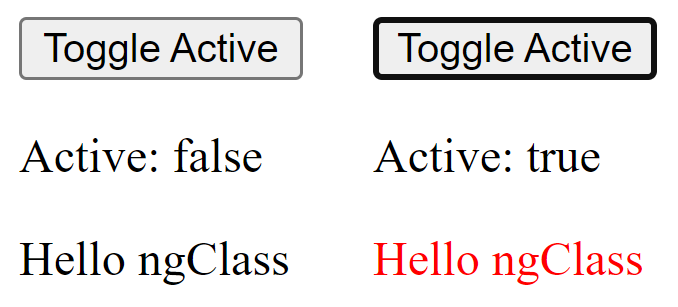
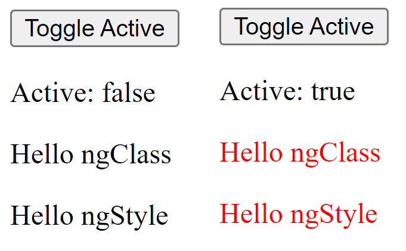

# ApexAngularBootcamp

**JP Note:**
<p style="color:red"><b>You are not allowed to copy this markdown without explicit permission.</b></p>

## First command

```bash
ng new apex-angular-bootcamp --standalone false
```

## Homework

Ejercicios individuales

---

### 1. Directivas de atributo

#### ngClass

**Descripción**

- Agregar una clase css llamada “**`redText`**” que ponga el color de texto en rojo.
- Agregar una variable boleana: “**`active`**” cuyo valor sea **false** por defecto.
- Agrega un botón con la leyenda "**Toggle Active**" que al ser presionado cambie el valor de la variable “**`active`**”.
  - Ejemplo:

  ```html
    <button type="button" alt="toggle" (click)="(active=!active)">
      Toggle Active
    </button>
  ```

- Agrega otro párrafo que despliegue el valor actual de la variable “**`active`**”, para esto utilizaremos la [interpolation](https://angular.io/guide/interpolation) como se muestra a continuación:

  ```html
    <p>Active: {{active}}</p>
  ```

- Usar [ngClass](https://angular.io/api/common/NgClass) en un párrafo `<p>Hello NgClass</p>` de tal forma que cuando la variable “**`active`**” sea verdadera se agregue dinámicamente y cambie el color del texto del párrafo.

**Criterio de aceptación**

- El contenido del párrafo deberá de cambiar a **rojo** si el valor de la variable “**`active`**” es **true**
- El contenido del párrafo deberá de cambiar al **color por defecto** si el valor de la variable “**`active`**” es **false**



#### ngStyle

**Descripción**

- Agrega otro párrafo `<p>Hello NgStyle</p>` debajo del párrafo anterior.
- Utiliza [ngStyle](https://angular.io/api/common/NgStyle) en este párrafo de tal forma que cuando la variable “**`active`**” sea verdadera el contenido del párrafo cambie de color también a `rojo`.

**Criterio de aceptación**

- El contenido del párrafo deberá de cambiar a **rojo** si el valor de la variable “**`active`**” es **true**
- El contenido del párrafo deberá de cambiar al **color por defecto** si el valor de la variable “**`active`**” es **false**



#### Git Commands

```bash
git checkout -b feature/1-directivas-de-atributo
git add .
git commit -m "1 - Directivas de atributo"
git push -u origin feature/1-directivas-de-atributo
```
